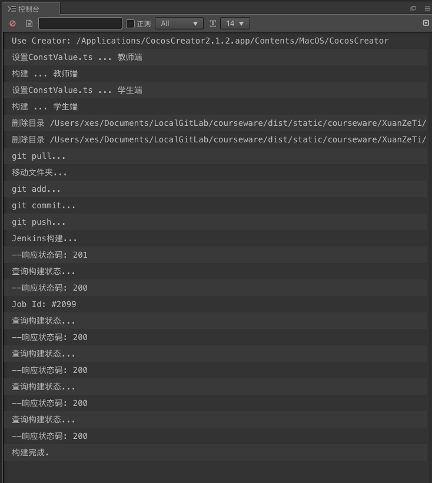

# 自动打包插件

## 功能
- 自动修改ConstValue.ts
- 自动设置正确的学生端和教师端场景进行构建
- 将构建后的学生端和教师端文件夹替换到courseware仓库并提交

 *新特性*
- 作为全局插件使用更友好，按项目分别记录历史发布路径
- 无需额外处理本地Creator安装路径(Mac及Windows)，即使本地安装多个Creator版本，会使用当前打开的Creator版本进行打包
- 自动触发Jenkins构建

## 使用方法
1. 拷贝 auto_deploy 文件夹到Cocos Creator全局扩展路径中(一个隐藏文件夹)。
    - ```Windows:   %USERPROFILE%\.CocosCreator\packages```
    - ```Mac:   $HOME/.CocosCreator/packages```

1. 配置config.json中的 'Account'，'Password' 字段，即Jenkins平台的账号和密码，只需配置一次。（'distPath'字段为插件自动维护的字段，映射了各个工程与发布目录的对应关系，不要手动修改)
1. 从编辑器工具栏 '扩展/audo_deploy/open' 打开插件面板
1. 点击'选择目录'按钮选择courseware仓库中对应课件发布路径，如：'/LocalGitLab/courseware/dist/static/courseware/ShuZiMi'.
   **配置过的路径会按照项目名称被分别持久化记录**
1. 填写git提交日志
1. 点击'构建发布'，关注编辑器控制台日志，当输出 '构建完成.' 即代表整个过程已完成。 
1. 一次成功的构建过程如图：



## 其他
- ### **不再推荐作为项目插件使用**
  - #### 难以维护
    - 项目数量庞大，修改插件逻辑需要同步修改所有项目
    - 项目插件如果纳入版本控制，插件配置文件中记录了本地历史发布路径，每个人本地目录结构是不同的，本地环境是跟版本无关的因素。